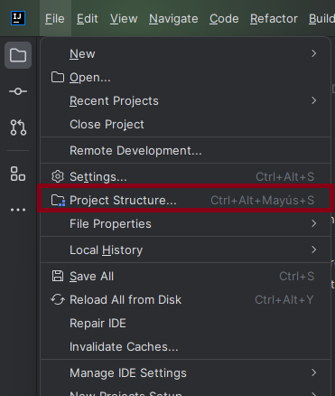
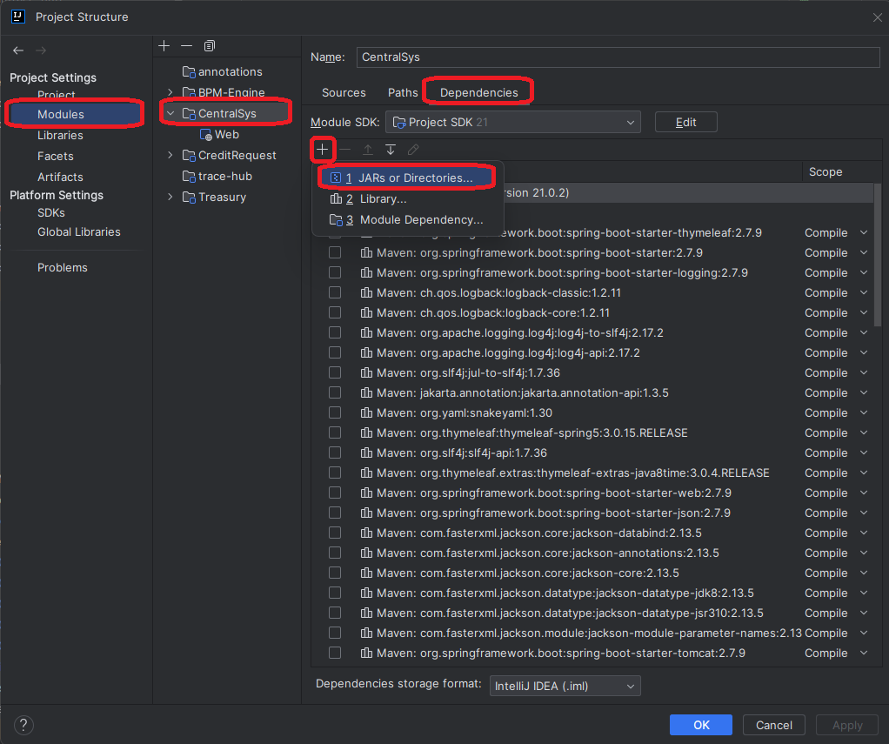
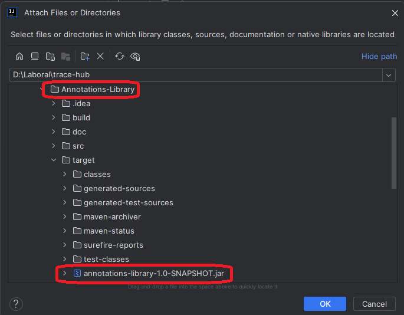

# Annotations
This repository contains the annotations that make traceability in an external information system possible.

## Index

1. [Description](#description)
2. [Prerequisites](#prerequisites)
3. [Usage](#usage)
4. [Annotations Library Configuration](#annotations-library-configuration)

## Description

[Spring initializr](https://start.spring.io/) is a tool that facilitates the creation of Spring Boot projects that integrate various dependencies such as Spring Data JPA, Spring Web, Lombok, Thymeleaf, DevTools. Spring Boot is a development framework that simplifies the creation of Web applications in Java.

This module is used exclusively to represent both activities and variables of a model in the external information system.

This module has 2 types of annotations with different scope:
* **Class Scope**: These annotations are used to represent an activity in the information system.
This annotation is ```@BPMNTask``` and receives as parameters the type of activity and the name of the activity.
Axis.```@BPMNTask(type = "userTask", name = "Review request details")```
* **Method Scope**: These annotations are used to represent where model variables are being obtained or modified
in the external information system. These annotations are ```@BPMNSetterVariables``` and ```@BPMNGetterVariables```
and receive as parameters the container (It is not mandatory to have one) with which the variable(s)
and the variable(s) itself are moved. E.g. ```@BPMNSetterVariables(variables = "allFine")``` , ```@BPMNGetterVariables(container = "CreditRequestDTO", variables = { "coupleName1", "coupleName2", ..... , "creationDate" })```

## Prerequisites

To use this program you need the following:

1. **Version control system**: Install GIT from the [GIT official website](https://git-scm.com/downloads).

2. **IntelliJ IDEA**: To run and/or modify the project, you can download it from the [IntelliJ official website](https://www.jetbrains.com/es-es/idea/download/?section=windows).

3. **Java 17 or higher**: You can get help to download and install the java version by following [this link](https://www.youtube.com/watch?v=oAin-q1oTDw&pp=ygUXY29tbyBjb25maWd1cmFyIGphdmEgMTc%3D)

4. **Maven 3.9**: You can get help to download and install the maven version by following [this link](https://www.youtube.com/watch?v=1QfiyR_PWxU&pp=ygUSaW5zdGFsYXIgbWF2ZW4gMy45)


## Usage

To use this module in your project:

1. Open a terminal in the folder where you want to download the program and clone it with:

   ```
   git clone https://github.com/BPMN-sw-evol/Annotations.git
   ```

2. Open the **Annotations** folder with a Windows terminal or console and type the following command:
   ```
   mvn clean package
   ```
   You must have installed a Maven version

3. The previous command generates a folder called target where there will be a .jar file which can be used in the other projects to use the annotations.

## Annotations Library Configuration

1. Click on "Project Structure"



2. Click on Modules > projectName > + > JARs or Directories...



3. Search the biptrac-annotations project and select the biptrac-annotations-1.0-SNAPSHOT.jar



4. Ready! You can use the annotations into your project.
